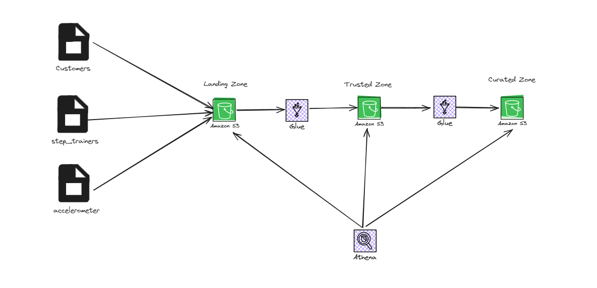

# Project: STEDI Human Balance Analytics
In this project, I'll act as a data engineer for the STEDI team to build a data lakehouse solution for sensor data that trains a machine learning model.

## Project Details
The STEDI Team has been hard at work developing a hardware STEDI Step Trainer that:
- trains the user to do a STEDI balance exercise;
- and has sensors on the device that collect data to train a machine-learning algorithm to detect steps;
- has a companion mobile app that collects customer data and interacts with the device sensors.

STEDI has heard from millions of early adopters who are willing to purchase the STEDI Step Trainers and use them.

Several customers have already received their Step Trainers, installed the mobile application, and begun using them together to test their balance. The Step Trainer is just a motion sensor that records the distance of the object detected. The app uses a mobile phone accelerometer to detect motion in the X, Y, and Z directions.

The STEDI team wants to use the motion sensor data to train a machine learning model to detect steps accurately in real-time. Privacy will be a primary consideration in deciding what data can be used.

Some of the early adopters have agreed to share their data for research purposes. Only these customers’ Step Trainer and accelerometer data should be used in the training data for the machine learning model.

### Architecture



## Initial Setup
The example data for that project can be found in the repository [here](https://github.com/udacity/nd027-Data-Engineering-Data-Lakes-AWS-Exercises/tree/main/project).

Steps to get the data into AWS S3:
1. Create an s3 bucket. 
2. Open the AWS Cloud Shell and cone the above repository.
3. Copy the required data into s3:

    ```bash
    cd nd027-Data-Engineering-Data-Lakes-AWS-Exercises/project/starter/

    aws s3 cp ./accelerometer/landing s3://human-balance-analytics-project/accelerometer/landing/ --recursive

    aws s3 cp ./customer/landing s3://human-balance-analytics-project/customer/landing/ --recursive

    aws s3 cp ./step_trainer/landing s3://human-balance-analytics-project/step_trainer/landing/ --recursive
    ```

4. Create an IAM role (***my-glue-service-role***) with the following policies:
    1. AWSGlueServiceRole:
        ```json
        {
            "Version": "2012-10-17",
            "Statement": [
                {
                    "Effect": "Allow",
                    "Action": [
                        "glue:*",
                        "s3:GetBucketLocation",
                        "s3:ListBucket",
                        "s3:ListAllMyBuckets",
                        "s3:GetBucketAcl",
                        "ec2:DescribeVpcEndpoints",
                        "ec2:DescribeRouteTables",
                        "ec2:CreateNetworkInterface",
                        "ec2:DeleteNetworkInterface",
                        "ec2:DescribeNetworkInterfaces",
                        "ec2:DescribeSecurityGroups",
                        "ec2:DescribeSubnets",
                        "ec2:DescribeVpcAttribute",
                        "iam:ListRolePolicies",
                        "iam:GetRole",
                        "iam:GetRolePolicy",
                        "cloudwatch:PutMetricData"
                    ],
                    "Resource": [
                        "*"
                    ]
                },
                {
                    "Effect": "Allow",
                    "Action": [
                        "s3:CreateBucket"
                    ],
                    "Resource": [
                        "arn:aws:s3:::aws-glue-*"
                    ]
                },
                {
                    "Effect": "Allow",
                    "Action": [
                        "s3:GetObject",
                        "s3:PutObject",
                        "s3:DeleteObject"
                    ],
                    "Resource": [
                        "arn:aws:s3:::aws-glue-*/*",
                        "arn:aws:s3:::*/*aws-glue-*/*"
                    ]
                },
                {
                    "Effect": "Allow",
                    "Action": [
                        "s3:GetObject"
                    ],
                    "Resource": [
                        "arn:aws:s3:::crawler-public*",
                        "arn:aws:s3:::aws-glue-*"
                    ]
                },
                {
                    "Effect": "Allow",
                    "Action": [
                        "logs:CreateLogGroup",
                        "logs:CreateLogStream",
                        "logs:PutLogEvents"
                    ],
                    "Resource": [
                        "arn:aws:logs:*:*:*:/aws-glue/*"
                    ]
                },
                {
                    "Effect": "Allow",
                    "Action": [
                        "ec2:CreateTags",
                        "ec2:DeleteTags"
                    ],
                    "Condition": {
                        "ForAllValues:StringEquals": {
                            "aws:TagKeys": [
                                "aws-glue-service-resource"
                            ]
                        }
                    },
                    "Resource": [
                        "arn:aws:ec2:*:*:network-interface/*",
                        "arn:aws:ec2:*:*:security-group/*",
                        "arn:aws:ec2:*:*:instance/*"
                    ]
                }
            ]
        }
        ```
    2. s3-access:

        ```json
        {
            "Version": "2012-10-17",
            "Statement": [
                {
                    "Sid": "ListObjectsInBucket",
                    "Effect": "Allow",
                    "Action": [
                        "s3:ListBucket"
                    ],
                    "Resource": [
                        "arn:aws:s3:::human-balance-analytics-project"
                    ]
                },
                {
                    "Sid": "AllObjectActions",
                    "Effect": "Allow",
                    "Action": "s3:*Object",
                    "Resource": [
                        "arn:aws:s3:::human-balance-analytics-project/*"
                    ]
                }
            ]
        }
        ```

## Project Data

### Customer Records
- This is the data from fulfillment and the STEDI website.
- [Data Download URL](https://github.com/udacity/nd027-Data-Engineering-Data-Lakes-AWS-Exercises/tree/main/project/starter/customer/landing)
- AWS S3 Bucket URI - s3://cd0030bucket/customers/
- contains the following fields:
    - serialnumber
    - sharewithpublicasofdate
    - birthday
    - registrationdate
    - sharewithresearchasofdate
    - customername
    - email
    - lastupdatedate
    - phone
    - sharewithfriendsasofdate

### Step Trainer Records
- This is the data from the motion sensor.
- [Data Download URL](https://github.com/udacity/nd027-Data-Engineering-Data-Lakes-AWS-Exercises/tree/main/project/starter/step_trainer/landing)
- AWS S3 Bucket URI - s3://cd0030bucket/step_trainer/
- contains the following fields:
    - sensorReadingTime
    - serialNumber
    - distanceFromObject

### Accelerometer Records
- This is the data from the mobile app.
- [Data Download URL](https://github.com/udacity/nd027-Data-Engineering-Data-Lakes-AWS-Exercises/tree/main/project/starter/accelerometer/landing)
- AWS S3 Bucket URI - s3://cd0030bucket/accelerometer/
- contains the following fields:
    - timeStamp
    - user
    - x
    - y
    - z

## Project Requirements Summary

- **S3 Directory Setup**
  - Create S3 directories: `customer_landing`, `step_trainer_landing`, `accelerometer_landing`.
  - Upload initial data sets to these directories.

- **AWS Glue Tables Creation**
  - Develop and share `customer_landing.sql` and `accelerometer_landing.sql` scripts.
  - Create Glue tables for customer and accelerometer landing zones.

- **Data Query and Visualization**
  - Query Glue tables using Athena.
  - Take and save screenshots of query results: `customer_landing.png/jpeg`, `accelerometer_landing.png/jpeg`.

- **AWS Glue Jobs for Data Sanitization**
  - Create a Glue Job to sanitize Customer data:
    - Store only Customer Records agreeing to share data in `customer_trusted` Glue Table.
  - Create a Glue Job to sanitize Accelerometer data:
    - Store only agreed data in `accelerometer_trusted` Glue Table.
  - Validate and take screenshots of `customer_trusted` table data.

- **Data Quality Issue Addressing**
  - Note: Serial numbers in Customer Data are not unique due to a fulfillment website defect.

- **Glue Job for Curated Customer Data**
  - Sanitize Customer data to include only those with accelerometer data in `customers_curated` Glue Table.

- **Glue Studio Jobs for Step Trainer Data**
  - Populate `step_trainer_trusted` Glue Table with Step Trainer IoT data for relevant customers.
  - Aggregate Step Trainer Readings with accelerometer data based on timestamps in `machine_learning_curated` Glue Table.

### Additional Notes
- Ensure data consistency and integrity throughout the processing.
- Regularly validate and test Glue jobs and Athena queries.
- Document each step and update the README accordingly.